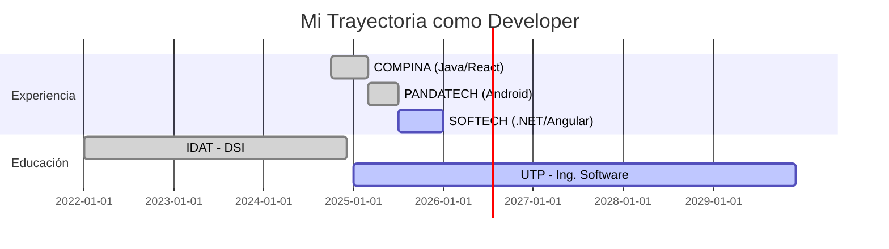

<div align="center">

# 👋 ¡Hola! Soy Axel


<br/>

### 💻 Full Stack Developer | Apasionado por la Arquitectura de Software

<p align="center">
  <a href="https://linkedin.com/in/tu-perfil"></a>
  <a href="mailto:tu-email@ejemplo.com"></a>
  <a href="https://tu-portfolio.com"></a>
  <a href="https://github.com/Axel-recq"></a>
</p>


</div>

---

## 🚀 Sobre mí

```typescript
const developer: Developer = {
  name: "Axel",
  role: "Full Stack Developer",
  location: "Lima, Perú 🇵🇪",
  company: "SOFTECH",
  education: {
    degree: "Ingeniería de Software",
    university: "UTP",
    previousStudies: "Desarrollo de Sistemas de Información - IDAT (Tercio Superior)"
  },
  experience: "1.5 años",
  workingOn: {
    frontend: ["Angular 19", "Angular Material", "TypeScript"],
    backend: [".NET 8", "C#", "Dapper", "SQL Server"],
    automation: ["N8N workflows"]
  },
  learning: ["Microservices", "Spring Cloud", "Kubernetes", "Docker"],
  passions: ["Clean Code", "System Design", "Problem Solving", "Cloud Native"],
  funFact: "Debugging es como ser detective en una película donde también eres el asesino 🔍"
};
```

<div align="center">

### 🎯 Focus Actual

</div>

<table align="center">
  <tr>
    <td align="center" width="50%">
      
      <br><strong>Frontend</strong>
      <br>Angular 19 + Material
      <br>Componentes Reactivos
    </td>
    <td align="center" width="50%">
      
      <br><strong>Backend</strong>
      <br>.NET 8 + Dapper
      <br>APIs RESTful
    </td>
  </tr>
  <tr>
    <td align="center">
      
      <br><strong>DevOps</strong>
      <br>Docker + GitHub Actions
      <br>CI/CD Pipelines
    </td>
    <td align="center">
      
      <br><strong>Cloud</strong>
      <br>Azure + GCP
      <br>Arquitectura Cloud Native
    </td>
  </tr>
</table>

---

## 🛠️ Arsenal Tecnológico

<div align="center">

### 🎨 Frontend Development


### ⚙️ Backend Development


### 📱 Mobile Development


### 🗄️ Databases & ORM


### ☁️ DevOps & Cloud


### 🧪 Testing & QA


### 🔧 Tools & Others


</div>

---

## 📊 GitHub Analytics

<div align="center">
  
  
</div>

<div align="center">
  
  
</div>

<div align="center">
  


</div>

---

## 💼 Trayectoria Profesional

<div align="center">



</div>

---

## 🏆 Certificaciones & Logros

<div align="center">

| 🎓 Certificación | 🏛️ Institución | 📅 Año |
|:----------------|:---------------|:-------|
| ✅ **Scrum Fundamentals Certified (SFC™)** | SCRUMstudy | 2025 |
| ✅ **Especialización en Java y Algoritmos** | Universidad Nacional de Ingeniería (UNI) | 2021 |
| ✅ **Arquitectura de Microservicios con Spring Boot** | Udemy | 2025 |
| ✅ **Azure DevOps: Gestión de Proyectos Empresariales** | Udemy | 2025 |
| ✅ **Google Cloud Platform - Fundamentos** | Udemy | 2025 |
| ✅ **Microsoft SQL Server Bootcamp 2024** | Udemy | 2024 |
| ✅ **IT Essentials: PC Hardware and Software** | Cisco Networking Academy | 2023 |
| ✅ **NDG Linux Essentials** | Cisco Networking Academy | 2023 |

</div>

---

## 🎯 Proyectos Destacados

<div align="center">

<table>
  <tr>
    <td width="50%">
      <h3 align="center">🏢 Sistema CRM</h3>
      <div align="center">
        <a href="https://github.com/Axel-recq/SISTEMA-CRM" target="_blank">
          
        </a>
        <p>
          
          
          
        </p>
      </div>
      <p><strong>Sistema de gestión de clientes</strong> con dashboard en tiempo real, autenticación JWT y seguimiento de oportunidades de venta.</p>
    </td>
    <td width="50%">
      <h3 align="center">🚚 API Gestión de Pedidos</h3>
      <div align="center">
        <a href="https://github.com/Axel-recq/Backend_API_Gestion_De_Pedidos" target="_blank">
          
        </a>
        <p>
          
          
          
        </p>
      </div>
      <p><strong>Backend robusto en .NET Core</strong> con arquitectura limpia, APIs RESTful documentadas con Swagger y Entity Framework Core.</p>
    </td>
  </tr>
  <tr>
    <td width="50%">
      <h3 align="center">📦 App de Trazabilidad</h3>
      <div align="center">
        <a href="https://github.com/Axel-recq/Trazabilidad-App" target="_blank">
          
        </a>
        <p>
          
          
          
        </p>
      </div>
      <p><strong>App Android nativa</strong> para seguimiento logístico con operación offline, Google Maps SDK y arquitectura MVC escalable.</p>
    </td>
    <td width="50%">
      <h3 align="center">🔗 Backend Node.js</h3>
      <div align="center">
        <a href="https://github.com/Axel-recq/Backend_node" target="_blank">
          
        </a>
        <p>
          
          
          
        </p>
      </div>
      <p><strong>Arquitectura orientada a eventos</strong> con motor v8, APIs RESTful y arquitectura de microservicios.</p>
    </td>
  </tr>
</table>

</div>

---

## 🌱 Aprendizaje Continuo

<div align="center">

```javascript
const currentlyLearning = {
  architecture: ["Microservices", "Event-Driven Architecture", "CQRS"],
  devops: ["Kubernetes", "Docker Compose", "CI/CD Pipelines"],
  cloud: ["Azure Functions", "GCP Cloud Run", "Serverless"],
  testing: ["E2E Testing", "TDD", "Performance Testing"],
  backend: ["Spring Cloud", "Temporal Workflows", "gRPC"]
};

console.log("🚀 Siempre en busca de nuevos desafíos técnicos!");
```

</div>

---

## 📈 Contribuciones Recientes

<!--START_SECTION:activity-->
<!--END_SECTION:activity-->

<div align="center">
  
</div>

---

## 💬 Conectemos

<div align="center">

### ¿Tienes un proyecto interesante? ¿Buscas colaborar?

**¡Me encantaría escucharte!**

<p align="center">
  <a href="https://linkedin.com/in/tu-perfil">
    
  </a>
  <a href="mailto:tu-email@ejemplo.com">
    
  </a>
  <a href="https://github.com/Axel-recq">
    
  </a>
  <a href="https://tu-portfolio.com">
    
  </a>
</p>

### 💭 Frase del Día


---

### 🎯 Filosofía de Código

<table align="center">
  <tr>
    <td align="center">
      
      <br><strong>Innovación</strong>
      <br><sub>Siempre buscando<br/>mejores soluciones</sub>
    </td>
    <td align="center">
      
      <br><strong>Calidad</strong>
      <br><sub>Código limpio<br/>y mantenible</sub>
    </td>
    <td align="center">
      
      <br><strong>Aprendizaje</strong>
      <br><sub>Mejora continua<br/>cada día</sub>
    </td>
    <td align="center">
      
      <br><strong>Colaboración</strong>
      <br><sub>Trabajo en equipo<br/>y comunicación</sub>
    </td>
  </tr>
</table>

---


<div align="center">
  
### 💡 *"Code is like humor. When you have to explain it, it's bad."* – Cory House


**⭐ Hecho con ❤️ y mucho ☕ por [Axel](https://github.com/Axel-recq)**

</div>

</div>
